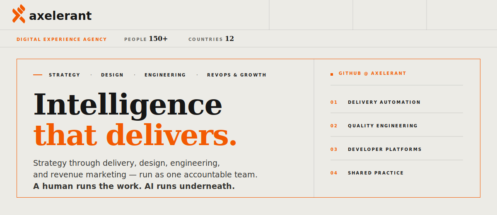

  <a href="https://www.axelerant.com/">Website</a> ·
  <a href="https://www.axelerant.com/success-stories">Our work</a> ·
  <a href="https://www.axelerant.com/blog">Insights</a> ·
  <a href="https://careers.axelerant.com/">Careers</a> ·
  <a href="https://www.axelerant.com/contact">Contact</a>

## Four capabilities, end to end.

Deep enough to lead each on its own. Integrated enough to run as one accountable team.

<table>
  <tr>
    <td width="50%" valign="top">
      01 · STRATEGY  
      <strong>Set the conditions.</strong> 
      Digital, technology, and data strategy, maturity assessment, and a roadmap sequenced into delivery.
    </td>
    <td width="50%" valign="top">
      02 · DESIGN  
      <strong>Shape the experience.</strong> 
      Product, brand, and service design, design systems, accessibility, and content models that hold across every screen.
    </td>
  </tr>
  <tr>
    <td width="50%" valign="top">
      03 · ENGINEERING  
      <strong>Build at scale.</strong> 
      Platform, application, AI, cloud, data, and quality engineering integrated as one resilient layer.
    </td>
    <td width="50%" valign="top">
      04 · REVOPS &amp; GROWTH  
      <strong>Move the metric.</strong> 
      CRM and marketing operations, demand, lifecycle, and optimization instrumented around the outcome.
    </td>
  </tr>
</table>

## Built in the open.

Our public work reflects how we deliver: practical automation, engineering quality, developer experience, and shared ways of working.

| Focus | Project | Built for |
| --- | --- | --- |
| Delivery automation | [`platformsh-action`](https://github.com/axelerant/platformsh-action) | Deploying to Platform.sh and cleaning up inactive environments with GitHub Actions. |
| Quality engineering | [`drupal-quality-checker`](https://github.com/axelerant/drupal-quality-checker) | Running consistent pre-commit quality checks across Drupal projects. |
| AI-assisted delivery | [`drupal-sdlc-plugin`](https://github.com/axelerant/drupal-sdlc-plugin) | Bringing AI-native automation into Drupal delivery workflows. |
| Developer platforms | [`backstage-plugins`](https://github.com/axelerant/backstage-plugins) | Extending Backstage with Axelerant-maintained platform integrations. |
| Shared practice | [`engg-handbook`](https://github.com/axelerant/engg-handbook) | Sharing how our engineers plan, build, review, and learn. |

Explore all our [public repositories](https://github.com/orgs/axelerant/repositories) or read the [Axelerant Engineering Handbook](https://engg-handbook.axelerant.com/).

## A human runs the work. AI runs underneath.

AI accelerates research, delivery, and operations. People stay accountable for the architecture, the decisions, the quality, and the metric we are here to move.

## Start a conversation.

Have a platform to modernize, a digital estate to consolidate, or an outcome to move? [See our work](https://www.axelerant.com/success-stories) or [tell us what you are working on](https://www.axelerant.com/contact).

Looking for a remote-first team built around trust, care, and learning? [Explore careers at Axelerant](https://careers.axelerant.com/).

  <a href="https://www.linkedin.com/company/axelerant">LinkedIn</a> ·
  <a href="https://x.com/axelerant">X</a> ·
  <a href="https://www.youtube.com/c/Axelerant">YouTube</a> ·
  <a href="https://www.instagram.com/axelerantcom/">Instagram</a>

